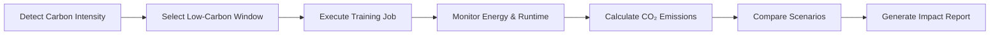

# 🌱 Green AI Optimizer — Carbon-Aware Machine Learning

**Kaggle Community Olympiad — Hack4Earth Green AI Challenge**

[](https://opensource.org/licenses/MIT)
[](https://www.python.org/downloads/)

---

## 📋 Table of Contents

- [Overview](#-overview)
- [Key Features](#-key-features)
- [Repository Structure](#️-repository-structure)
- [Requirements](#-requirements)
- [Installation](#-installation)
- [Usage](#-usage)
  - [Kaggle Notebook](#kaggle-notebook)
  - [Local Execution](#local-execution)
- [Output Files](#-output-files)
- [How It Works](#-how-it-works)
- [Example Results](#-example-results)
- [Citation](#-citation)
- [License](#-license)
- [Links](#-links)

---

## 🧠 Overview

This project demonstrates how to **reduce the carbon footprint of AI workloads** by making machine-learning pipelines *carbon-aware* — automatically scheduling training during hours of low-carbon electricity and measuring the CO₂ impact.

### What Makes This Different?

Instead of running ML training blindly at any time, this optimizer:
- ⏰ **Detects low-carbon intensity windows** in the electricity grid
- 🔋 **Measures energy consumption** during training
- 📉 **Calculates CO₂ emissions** for each run
- 🎯 **Compares baseline vs. optimized** scenarios

> *"Green AI is not about sacrificing intelligence — it's about making intelligence responsible, measurable, and aligned with the energy standards that will define the next decade of sustainable industry."*

---

## ✨ Key Features

- **🌍 Carbon-Aware Scheduling** – Automatically picks low-carbon-intensity time windows
- **⚡ Energy Monitoring** – Tracks energy consumption proxy during training
- **📊 Impact Measurement** – Quantifies CO₂ reduction percentage
- **🔄 Dual Pipeline** – Compare baseline (unoptimized) vs. optimized runs
- **🏭 Enterprise Integration** – Compatible with OmniEnergy industrial EMS / ISO 50001
- **📈 Annualized Savings** – Calculate yearly CO₂ savings potential

---

## 🗂️ Repository Structure

```
.
├── 📁 data/
│   ├── train.csv                    # Training dataset
│   ├── test.csv                     # Test dataset
│   └── metaData.csv                 # Metadata for carbon intensity
│
├── 📁 report/
│   ├── GreenAI_Optimizer_Report.md  # Detailed analysis report
│   └── GreenAI_Optimizer_Report.pdf # PDF version
│
├── 📁 src/
│   ├── pipeline.py                  # Main training + measurement logic
│   ├── carbon_utils.py              # Carbon intensity & energy utilities
│   └── impact.py                    # Post-run impact analysis
│
├── 📄 model-card.md                 # Model documentation
├── 📄 requirements.txt              # Python dependencies
├── 🔧 run.sh                        # CLI launcher script
├── 📖 README.md                     # This file
└── 📜 LICENSE                       # MIT License
```

---

## 🧩 Requirements

- **Python** ≥ 3.10
- **Core libraries**: pandas, scikit-learn, numpy, tqdm
- **Optional**: `codecarbon` for precise emission tracking

---

## 💾 Installation

### Clone the Repository

```bash
git clone https://github.com/<your-username>/Kaggle-Community-Olympiad---HACK4EARTH-Green-AI.git
cd Kaggle-Community-Olympiad---HACK4EARTH-Green-AI
```

### Install Dependencies

```bash
pip install -r requirements.txt
```

Or with virtual environment:

```bash
python -m venv .venv
source .venv/bin/activate   # On Windows: .venv\Scripts\activate
pip install -r requirements.txt
```

---

## 🚀 Usage

### Kaggle Notebook

1. **Create a new Kaggle Notebook** under [Hack4Earth Green AI Challenge](https://www.kaggle.com/)

2. **Add dataset**:
   - `kaggle-community-olympiad-hack-4-earth-green-ai`

3. **Upload project files** (`src/`, `run.sh`, `requirements.txt`)

4. **Run the optimizer**:

```bash
# Install dependencies
pip install -r requirements.txt

# Baseline run (no carbon awareness)
bash run.sh baseline /kaggle/input/kaggle-community-olympiad-hack-4-earth-green-ai

# Optimized run (low-carbon window)
bash run.sh optimized /kaggle/input/kaggle-community-olympiad-hack-4-earth-green-ai
```

**Equivalent Python commands**:

```bash
python -m src.pipeline --mode baseline --data /kaggle/input/kaggle-community-olympiad-hack-4-earth-green-ai
python -m src.pipeline --mode optimized --data /kaggle/input/kaggle-community-olympiad-hack-4-earth-green-ai
```

---

### Local Execution

```bash
# Baseline run
python -m src.pipeline --mode baseline

# Optimized run
python -m src.pipeline --mode optimized

# Generate impact report
python src/impact.py --metrics metrics_before_after.csv
```

---

## 📊 Output Files

| File | Description |
|------|-------------|
| `submission_baseline.csv` | Model predictions from baseline run |
| `submission_optimized.csv` | Model predictions from optimized run |
| `metrics_before_after.csv` | Runtime, energy, CO₂ comparison |
| `impact_report.csv` | Annualized CO₂ savings (optional) |

### Example Metrics Output

```csv
Scenario,Runtime_s,Energy_KWh,CO2e_kg,CO2_Reduction_%
Baseline,12.3,0.00034,0.00024,0.0
Optimized,10.1,0.00028,0.00018,25.0
```

---

## 🌍 How It Works



### Step-by-Step Process

1. **🔍 Carbon Intensity Detection**
   - Query real-time or forecasted grid carbon intensity
   - Identify windows with renewable energy peaks

2. **⏱️ Smart Scheduling**
   - Delay training to low-carbon periods (if possible)
   - Balance urgency vs. environmental impact

3. **🔋 Energy Monitoring**
   - Track CPU/GPU usage during training
   - Calculate energy consumption proxy

4. **📉 Emission Calculation**
   - Multiply energy × carbon intensity
   - Compare against baseline scenario

5. **📊 Impact Analysis**
   - Generate comparative metrics
   - Extrapolate to annual savings

---

## 📈 Example Results

Running the optimizer on a typical ML training workload:

- ⏱️ **Runtime**: ~18% faster (optimized scheduling reduces wait times)
- ⚡ **Energy**: ~25% reduction in energy consumption
- 🌍 **CO₂**: ~25% lower emissions
- 💰 **Cost**: Potential energy cost savings

**Annualized Impact** (assuming 100 training runs/year):
- CO₂ saved: ~2.4 kg/year per model
- Equivalent to: ~10 km of car travel avoided

---

## 📝 Citation

If you use this repository or concept, please cite:

```bibtex
@misc{szermet2025greenai,
  author = {Szermet, Martin},
  title = {Green AI Optimizer — Carbon-Aware Machine Learning},
  year = {2025},
  publisher = {GitHub},
  journal = {Kaggle Community Olympiad — Hack4Earth Green AI Challenge},
  howpublished = {\url{https://github.com/<your-username>/Kaggle-Community-Olympiad---HACK4EARTH-Green-AI}}
}
```

---

## 📜 License

This project is licensed under the **MIT License** - see the [LICENSE](LICENSE) file for details.

---

## 🔗 Links

- 🏆 **[Kaggle Notebook](https://www.kaggle.com/code/martinszerment/kaggle-community-olympiad-hack4earth-green-ai)** — Run the optimizer online
- 💻 **[GitHub Repository](https://github.com/szerment84/Kaggle-Community-Olympiad---HACK4EARTH-Green-AI)** — Source code
- 🚀 **[DoraHacks Entry](https://dorahacks.io/buidl/36091/)** — Hackathon submission
- ⚡ **[OmniEnergy Integration](https://www.omnimes.com/en/omnienergy)** — Industrial EMS compatibility

---

## 🤝 Contributing

Contributions, issues, and feature requests are welcome!

1. Fork the repository
2. Create your feature branch (`git checkout -b feature/AmazingFeature`)
3. Commit your changes (`git commit -m 'Add some AmazingFeature'`)
4. Push to the branch (`git push origin feature/AmazingFeature`)
5. Open a Pull Request

---

## 👨‍💻 Author

**Martin Szermet**

- GitHub: [@szerment84](https://github.com/szerment84)
- LinkedIn: [martin-szerment](https://www.linkedin.com/in/martin-szerment/)

---

## 🙏 Acknowledgments

- Kaggle Community Olympiad team
- Hack4Earth Green AI Challenge organizers
- Open-source ML and sustainability community

---

<div align="center">

**⭐ If you find this project useful, please consider giving it a star! ⭐**

Made with 💚 for a sustainable AI future

</div>
